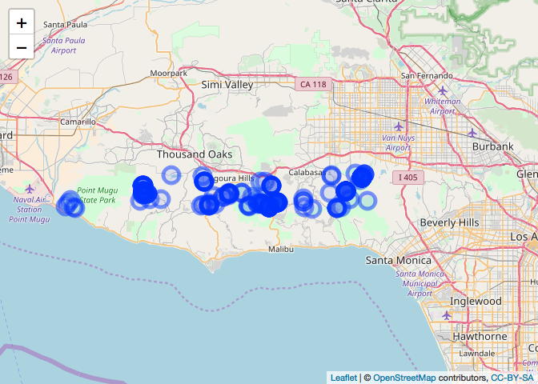
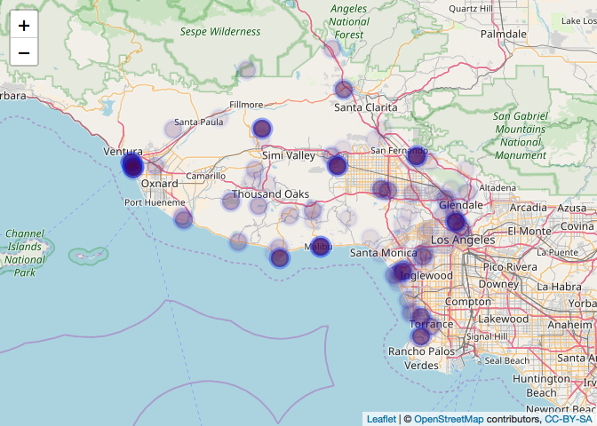
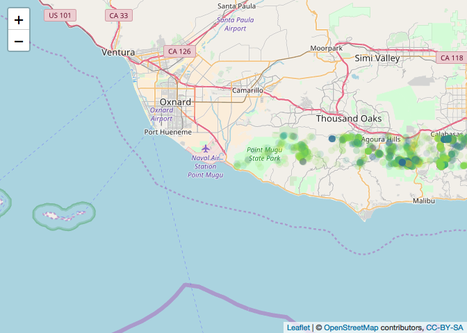
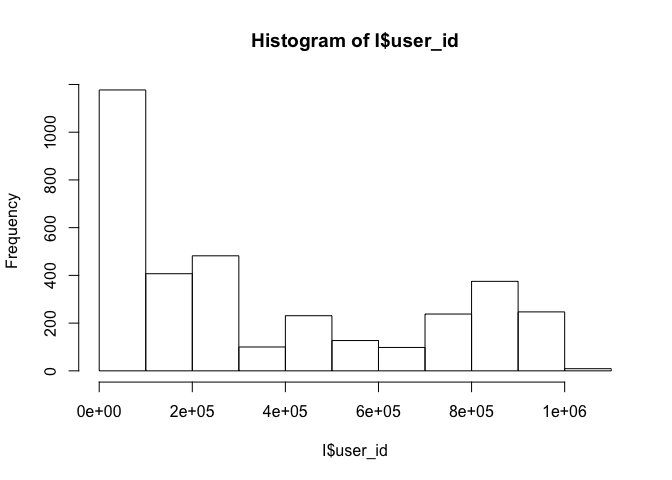

social\_biodiv
================
Ilya
6/23/2018

##### To do:

##### 1) try python wrapper for ebird data \#\#\#\#\#(<https://pypi.org/project/ebird-api/>)

##### install and load reticulate

    ## Downloading GitHub repo yihui/knitr@master
    ## from URL https://api.github.com/repos/yihui/knitr/zipball/master

    ## Installing knitr

    ## '/Library/Frameworks/R.framework/Resources/bin/R' --no-site-file  \
    ##   --no-environ --no-save --no-restore --quiet CMD INSTALL  \
    ##   '/private/var/folders/0d/qm_pqljx11s_ddc42g1_yscr0000gn/T/Rtmprycn0Z/devtools116d16d501ee7/yihui-knitr-2b3e617'  \
    ##   --library='/Library/Frameworks/R.framework/Versions/3.4/Resources/library'  \
    ##   --install-tests

    ## 

##### install using py\_install

    ## virtualenv: ~/.virtualenvs/r-reticulate 
    ## Upgrading pip ...
    ## Upgrading wheel ...
    ## Upgrading setuptools ...
    ## Installing packages ...
    ## 
    ## Installation complete.

##### import python packages

``` r
flickrapi <- import("flickrapi")
```

##### import flickrapi, load keys in python, do search for birds in Santa Monica Hills

``` python
#####################################################################################
#import packages
import flickrapi
import pandas as pd
import csv
#####################################################################################
#key and secret
api_key_file = "/Users/fischhoff/ilya documents/R/social_biodiv/flickr_api_key.txt"
with open(api_key_file, "r") as keyfile:
    api_key = keyfile.read()
api_key
#get secret
api_secret_file = "/Users/fischhoff/ilya documents/R/social_biodiv/flickr_api_secret.txt"
with open(api_secret_file, "r") as keyfile:
    secret_api_key = keyfile.read()
#####################################################################################
#do search
#https://www.flickr.com/groups/51035612836@N01/discuss/72157668638670202/
flickr = flickrapi.FlickrAPI(api_key, secret_api_key, format='parsed-json')
extras='url_m,geo,tags,owner_name,date_taken,date_upload,description'
#bbox
LLX = -119.065606
LLY = 34.09166
URX=-118.540862
URY = 34.142754
bb = str(LLX) + ',' + str(LLY) + ',' + str(URX) + ',' + str(URY)
query = 'birds'
#search
page_no = 1
parameters = { 'bbox': bb, 
'tags': query, 
#'tag_mode':'all', #note: if using tag_mode: all then comment out tags: query
'per_page':250, 
'page': page_no, 
'has_geo':1, 
'accuracy':14,
'extras': extras}
init = flickr.photos.search(**parameters)
pages = init['photos']['pages']
print(pages)
```

    ## 1

``` python
total = init['photos']['total']
print(total)
#####################################################################################
#output to csv
```

    ## 129

``` python
df = pd.DataFrame.from_dict(init)
d = df['photos']['photo']
d_first_page= pd.DataFrame.from_records(d, columns = ['id', 'owner', 'description', 'latitude', 'longitude'])
d_first_page.to_csv('flickr.bird.csv')
```

##### make map of flickr data for photos in Santa Monica Mtns w/ "birds" as tag

``` r
F = read.csv('flickr.bird.csv')
#find centroid of area of interest
clat =median(F$latitude)
clon = median(F$longitude)
#Fmap <- leaflet(F) %>%
leaflet(F) %>%

  addTiles() %>%
      setView(lat = clat, lng=clon, zoom =10) %>%

    #add polygons for dma.ggl 
  addCircleMarkers(fillOpacity = 0.1)
```

    ## Assuming "longitude" and "latitude" are longitude and latitude, respectively


``` r
#mapshot(Fmap, file = "flickr.bird.santamonica.png")
#Fmap
```

##### import flickrapi, load keys in python, do general search of Santa Monica Hills -- not restricted to any tag

``` python
import flickrapi
import pandas as pd
#####################################################################################
#key and secret
api_key_file = "/Users/fischhoff/ilya documents/R/social_biodiv/flickr_api_key.txt"
with open(api_key_file, "r") as keyfile:
    api_key = keyfile.read()
api_key
#get secret
api_secret_file = "/Users/fischhoff/ilya documents/R/social_biodiv/flickr_api_secret.txt"
with open(api_secret_file, "r") as keyfile:
    secret_api_key = keyfile.read()
#print(secret_api_key)
#####################################################################################
#do search
flickr = flickrapi.FlickrAPI(api_key, secret_api_key, format='parsed-json')
extras='url_m,geo,tags,owner_name,date_taken,date_upload,description'
#bbox
LLX = -119.065606
LLY = 34.09166
URX=-118.540862
URY = 34.142754
bb = str(LLX) + ',' + str(LLY) + ',' + str(URX) + ',' + str(URY)
page_no = 1
parameters = { 'bbox': bb, 
'tag_mode':'all', #note: if using tag_mode: all then comment out tags: query
'per_page':250, 
'page': page_no, 
'has_geo':1, 
'accuracy':15,
'extras': extras}
init = flickr.photos.search(**parameters)
#init = flickr.groups.pools.getPhotos(**parameters)#https://stackoverflow.com/questions/29651576/python-flickr-api-for-group-search-and-get-image-data-set
pages = init['photos']['pages']
print("pages")
```

    ## pages

``` python
print(pages)
```

    ## 67

``` python
total = init['photos']['total']
print("photos")
```

    ## photos

``` python
print(total)
#####################################################################################
#write to csv
```

    ## 16750

``` python
df = pd.DataFrame.from_dict(init)
d = df['photos']['photo']
d_first_page= pd.DataFrame.from_records(d, columns = ['id', 'owner', 'description', 'latitude', 'longitude'])
print("shape of first page")
```

    ## shape of first page

``` python
print(d_first_page.shape)
```

    ## (250, 5)

``` python
d_first_page.to_csv('flickr.all.sm.csv')
```

##### make map of flickr data for photos in Santa Monica Mtns w/ no restriction on tag

``` r
F = read.csv('flickr.all.sm.csv')
#find centroid of area of interest
clat =median(F$latitude)
clon = median(F$longitude)
Fmap <- leaflet(F) %>%
  addTiles() %>%
      setView(lat = clat, lng=clon, zoom =10) %>%

    #add polygons for dma.ggl 
  addCircleMarkers(fillOpacity = 0.1)
```

    ## Assuming "longitude" and "latitude" are longitude and latitude, respectively

``` r
mapshot(Fmap, file = "flickr.bird.santamonica.png")

Fmap
```



``` r
#ggplot(data = F, mapping = aes(x = longitude, y = latitude))+
#  geom_point()
```

eBird
=====

##### get recent ebird data using R package rebird; plot with fill color darkness proportional to \#birds seen

``` r
X = -118.75#approx x and y for Santa Monica Mountains
Y = 34.12
E = ebirdgeo(species=NULL, lat = Y, lng = X, back = 30, dist= 50)
head(E)
```

    ## # A tibble: 6 x 12
    ##     lng locName howMany sciName obsValid locationPrivate obsDt obsReviewed
    ##   <dbl> <chr>     <int> <chr>   <lgl>    <lgl>           <chr> <lgl>      
    ## 1 -119. Calleg…       3 Geothl… TRUE     FALSE           2018… FALSE      
    ## 2 -119. Calleg…       1 Icteri… TRUE     FALSE           2018… FALSE      
    ## 3 -119. Calleg…      30 Hirund… TRUE     FALSE           2018… FALSE      
    ## 4 -119. Calleg…       3 Mimus … TRUE     FALSE           2018… FALSE      
    ## 5 -119. Calleg…       5 Haemor… TRUE     FALSE           2018… FALSE      
    ## 6 -119. Calleg…       4 Quisca… TRUE     FALSE           2018… FALSE      
    ## # ... with 4 more variables: comName <chr>, lat <dbl>, locID <chr>,
    ## #   locId <chr>

``` r
names(E)
```

    ##  [1] "lng"             "locName"         "howMany"        
    ##  [4] "sciName"         "obsValid"        "locationPrivate"
    ##  [7] "obsDt"           "obsReviewed"     "comName"        
    ## [10] "lat"             "locID"           "locId"

``` r
pal <- colorNumeric("viridis", NULL)

leaflet(E) %>%
  addTiles() %>%
      setView(lat = Y, lng=X, zoom =9) %>%
  addCircleMarkers(lng=E$lng, lat = E$lat, fillOpacity = 0.1, opacity =0.05, fillColor=~pal(E$howMany)                    )
```



iNaturalist
===========

##### get iNat data for Santa Monica Mountains using R package rinat; plot on map with fill color equal to userid

``` r
#vignette:  https://cran.r-project.org/web/packages/rinat/vignettes/rinatVignette.html
LLX = -119.065606
LLY = 34.09166
URX=-118.540862
URY = 34.142754
#southern latitude, western longitude, northern latitude, and eastern longitude
bounds <- c(LLY, LLX, URY, URX)
I <- get_inat_obs(query = NULL, bounds = bounds, year = 2018, geo=TRUE, maxresults = 10000)
dim(I)
```

    ## [1] 3609   37

##### plot iNat data on map with fill color equal to iconic name

``` r
I = subset(I, iconic_taxon_name !="")
Y = mean(LLY, URY)
X = median(LLX, URX)
pal <- colorNumeric("viridis", NULL)

Imap <- leaflet(I) %>%
  addTiles() %>%
      setView(lat = Y, lng=X, zoom =10) %>%
  addCircleMarkers(lng=I$longitude, lat = I$latitude, fillOpacity = 0.15, opacity =0.0, 
                   radius = 5,
                   color =~pal(as.numeric(as.factor(I$iconic_taxon_name))),
                               fillColor=~pal(as.numeric(as.factor(I$iconic_taxon_name)))
                   )
Imap
```



##### find out how many iNat users are represented in dataset

``` r
length(unique(I$user_id))
```

    ## [1] 316

``` r
hist(I$user_id)
```


