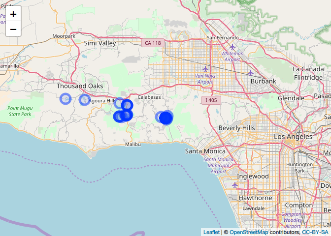
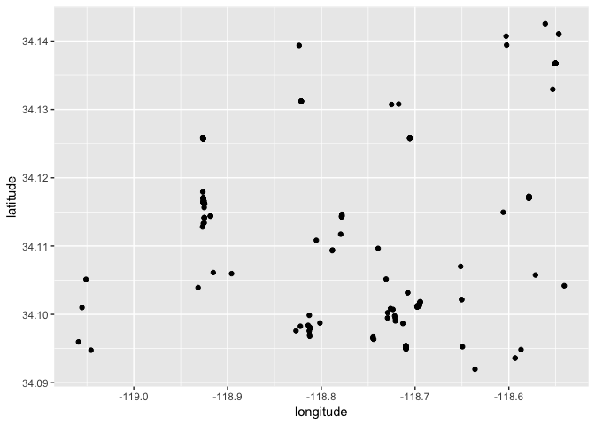

social\_biodiv
================
Ilya
6/23/2018

##### install and load reticulate

    ## Downloading GitHub repo yihui/knitr@master
    ## from URL https://api.github.com/repos/yihui/knitr/zipball/master

    ## Installing knitr

    ## '/Library/Frameworks/R.framework/Resources/bin/R' --no-site-file  \
    ##   --no-environ --no-save --no-restore --quiet CMD INSTALL  \
    ##   '/private/var/folders/0d/qm_pqljx11s_ddc42g1_yscr0000gn/T/Rtmp3NODUt/devtools107906433b6ab/yihui-knitr-2b3e617'  \
    ##   --library='/Library/Frameworks/R.framework/Versions/3.4/Resources/library'  \
    ##   --install-tests

    ## 

##### install using py\_install

    ## virtualenv: ~/.virtualenvs/r-reticulate 
    ## Upgrading pip ...
    ## Upgrading wheel ...
    ## Upgrading setuptools ...
    ## Installing packages ...
    ## 
    ## Installation complete.

##### import python packages

``` r
flickrapi <- import("flickrapi")
```

##### import flickrapi, load keys in python, do search for birds in Santa Monica Hills

``` python
#####################################################################################
#import packages
import flickrapi
import pandas as pd
import csv
#####################################################################################
#key and secret
api_key_file = "/Users/fischhoff/ilya documents/R/social_biodiv/flickr_api_key.txt"
with open(api_key_file, "r") as keyfile:
    api_key = keyfile.read()
api_key
#get secret
api_secret_file = "/Users/fischhoff/ilya documents/R/social_biodiv/flickr_api_secret.txt"
with open(api_secret_file, "r") as keyfile:
    secret_api_key = keyfile.read()
#####################################################################################
#do search
#https://www.flickr.com/groups/51035612836@N01/discuss/72157668638670202/
flickr = flickrapi.FlickrAPI(api_key, secret_api_key, format='parsed-json')
extras='url_m,geo,tags,owner_name,date_taken,date_upload,description'
#bbox
LLX = -119.065606
LLY = 34.09166
URX=-118.540862
URY = 34.142754
bb = str(LLX) + ',' + str(LLY) + ',' + str(URX) + ',' + str(URY)
query = 'birds'
#search
page_no = 1
parameters = { 'bbox': bb, 
'tags': query, 
#'tag_mode':'all', #note: if using tag_mode: all then comment out tags: query
'per_page':250, 
'page': page_no, 
'has_geo':1, 
'accuracy':14,
'extras': extras}
init = flickr.photos.search(**parameters)
pages = init['photos']['pages']
print(pages)
```

    ## 1

``` python
total = init['photos']['total']
print(total)
#####################################################################################
#output to csv
```

    ## 132

``` python
df = pd.DataFrame.from_dict(init)
d = df['photos']['photo']
d_first_page= pd.DataFrame.from_records(d, columns = ['id', 'owner', 'description', 'latitude', 'longitude'])
d_first_page.to_csv('flickr.bird.csv')
```

##### make map of flickr data for photos in Santa Monica Mtns w/ "birds" as tag

``` r
F = read.csv('flickr.bird.csv')
#find centroid of area of interest
clat =median(F$latitude)
clon = median(F$longitude)
#Fmap <- leaflet(F) %>%
leaflet(F) %>%

  addTiles() %>%
      setView(lat = clat, lng=clon, zoom =10) %>%

    #add polygons for dma.ggl 
  addCircleMarkers(fillOpacity = 0.1)
```

    ## Assuming "longitude" and "latitude" are longitude and latitude, respectively



``` r
#mapshot(Fmap, file = "flickr.bird.santamonica.png")
#Fmap
```

##### import flickrapi, load keys in python, do general search of Santa Monica Hills -- not restricted to any tag

``` python
import flickrapi
import pandas as pd
#####################################################################################
#key and secret
api_key_file = "/Users/fischhoff/ilya documents/R/social_biodiv/flickr_api_key.txt"
with open(api_key_file, "r") as keyfile:
    api_key = keyfile.read()
api_key
#get secret
api_secret_file = "/Users/fischhoff/ilya documents/R/social_biodiv/flickr_api_secret.txt"
with open(api_secret_file, "r") as keyfile:
    secret_api_key = keyfile.read()
#print(secret_api_key)
#####################################################################################
#do search
flickr = flickrapi.FlickrAPI(api_key, secret_api_key, format='parsed-json')
extras='url_m,geo,tags,owner_name,date_taken,date_upload,description'
#bbox
LLX = -119.065606
LLY = 34.09166
URX=-118.540862
URY = 34.142754
bb = str(LLX) + ',' + str(LLY) + ',' + str(URX) + ',' + str(URY)
page_no = 1
parameters = { 'bbox': bb, 
'tag_mode':'all', #note: if using tag_mode: all then comment out tags: query
'per_page':250, 
'page': page_no, 
'has_geo':1, 
'accuracy':15,
'extras': extras}
init = flickr.photos.search(**parameters)
#init = flickr.groups.pools.getPhotos(**parameters)#https://stackoverflow.com/questions/29651576/python-flickr-api-for-group-search-and-get-image-data-set
pages = init['photos']['pages']
print("pages")
```

    ## pages

``` python
print(pages)
```

    ## 70

``` python
total = init['photos']['total']
print("photos")
```

    ## photos

``` python
print(total)
#####################################################################################
#write to csv
```

    ## 17471

``` python
df = pd.DataFrame.from_dict(init)
d = df['photos']['photo']
d_first_page= pd.DataFrame.from_records(d, columns = ['id', 'owner', 'description', 'latitude', 'longitude'])
print("shape of first page")
```

    ## shape of first page

``` python
print(d_first_page.shape)
```

    ## (250, 5)

``` python
d_first_page.to_csv('flickr.all.sm.csv')
```

##### make map of flickr data for photos in Santa Monica Mtns w/ no restriction on tag

``` r
F = read.csv('flickr.all.sm.csv')
#find centroid of area of interest
clat =median(F$latitude)
clon = median(F$longitude)
Fmap <- leaflet(F) %>%
  addTiles() %>%
      setView(lat = clat, lng=clon, zoom =10) %>%

    #add polygons for dma.ggl 
  addCircleMarkers(fillOpacity = 0.1)
```

    ## Assuming "longitude" and "latitude" are longitude and latitude, respectively

``` r
mapshot(Fmap, file = "flickr.bird.santamonica.png")

Fmap
```


``` r
ggplot(data = F, mapping = aes(x = longitude, y = latitude))+
  geom_point()
```


